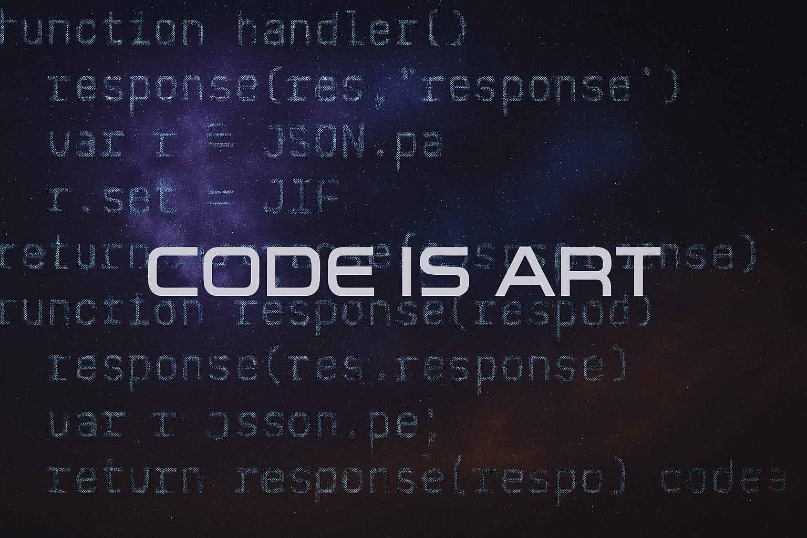

## Hi there 👋

....

## 🧰 Tech Stack

 
 

## ⚡ Последние проекты

|Name|---|repo|🧰 Tech Stack|
|---|---|---|---|
|🧬 Genealogy|desktop|[repo](https://github.com/wolk8506/genealogy)|              |
|Нагрузочное тестирование Frontend|---|---|        |
|Нагрузочное тестирование Backend|---|---|       |
|🎧 онлайн-радио|[page](wolk8506.github.io/radio-react/)|[repo](https://github.com/wolk8506/radio-react)|             |
|🎧 онлайн-радио-backend|---|[repo](https://github.com/wolk8506/radio-react-backend)|      |
|---|---|---|---|
|🧪 динамическая проверка пользовательских статусов|[UI-тесты](https://github.com/...) |---|    |
|phonebook|[page](wolk8506.github.io/phonebook/)|[repo](https://github.com/wolk8506/phonebook)|---|
|---|---|---|---|
|filmoteka|[page](wolk8506.github.io/filmoteka/)|[repo](https://github.com/wolk8506/filmoteka)|         |
|🌄 Поиск изображений|[Поиск изображений](https://wolk8506.github.io/goit-react-hw-04-images/) |[repe](https://github.com/wolk8506/goit-react-hw-04-images)|     |
|🧑‍🚀 space-tourism|[page](https://wolk8506.github.io/space-tourism/)|[repo](https://github.com/wolk8506/space-tourism)|  |
|🍦 icecream|[page](https://wolk8506.github.io/icecream/)|[repo](https://github.com/wolk8506/icecream)|  |
|💇‍♂️ BarberShop |[landing](https://wolk8506.github.io/barbershop/)|[repo](https://github.com/wolk8506/barbershop)|  |
|👨‍💻 WebStudio|[landing](https://wolk8506.github.io/webstudio/)|[repo](https://github.com/wolk8506/webstudio)|  |

- 

## 📫 Контакты

## -------

